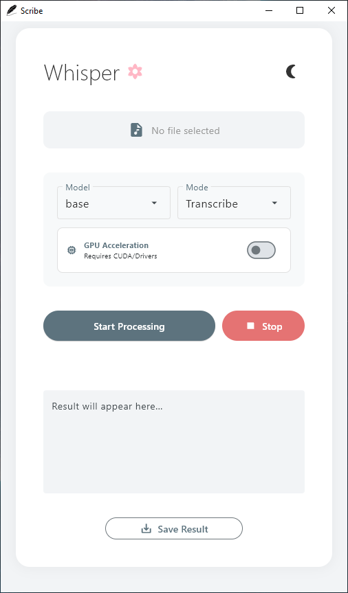
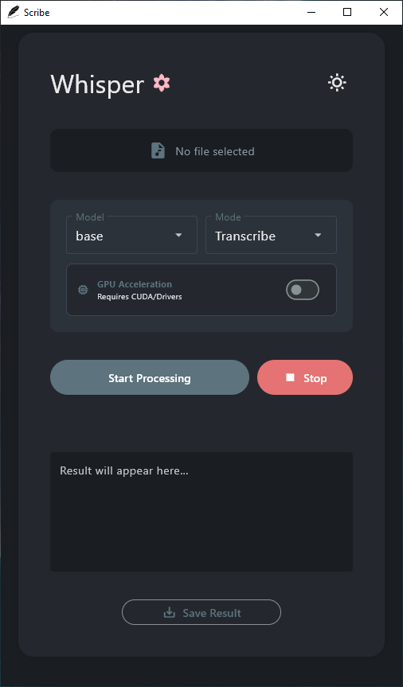

# Scribe – a tiny, friendly faster whisper GUI

A single-file desktop app that turns any audio/video into text (or English) with a click.

 

## What it looks like

| Light mode | Dark mode |
|------------|-----------|
|  |  |

## Features

- **Faster Whisper under the hood** – tiny → large-v2 models, auto-downloaded on first use  
- **Two modes** – transcribe in the original language or translate straight to english  
- **GPU boost** – toggle CUDA if you have it, CPU if you don’t  
- **Live progress** – watch the words appear as they’re recognised  
- **Export** – save as plain text, SRT subtitles, or full JSON with timestamps  
- **Dark / light** – one-click toggle, remembers your mood  
- **Single file** – the whole app is `whisper_ui.py` (or grab the ready-made .exe)

## Download the Windows .exe (No Python required)

The easiest way to use Scribe.

**[Download Scribe.exe v1.0.0](https://github.com/ghimirermn/Scribe/releases/tag/v1.0.0)**

- Download `Scribe.exe`  
- Run it — no installation, no Python  
- On first run, the model you select will be auto-downloaded  
- Supports: mp3, wav, m4a, flac, ogg, mp4, mkv, mov, and many more

## Install/Run via Python

1. **Python 3.8+** (3.11 recommended)  
2. Clone or download this folder  
3. `pip install -r requirements.txt`
4. `python whisper_ui.py`
5. Drop an audio/video file on the window and hit **Start Processing**

That’s it—no Whisper knowledge required.

## Requirements
flet>=0.22.0
faster-whisper>=0.10.0

(The file is already there, just run the command above.)

## Usage tips

- First run downloads the model you pick; each size is ±75 MB (tiny) → 3 GB (large-v2).  
- CUDA drivers must match PyTorch if you enable GPU; otherwise leave it off.  
- Supported formats: mp3, wav, m4a, flac, ogg, mp4, mkv, mov… almost anything FFmpeg can read.  
- Stop button cancels cleanly and keeps whatever was recognised so far.  
- Saved files get the transcript + “.txt/.srt/.json” unless you change it.

## Licence

MIT – do what you want, just don’t blame me if it mis-hears your karaoke.

